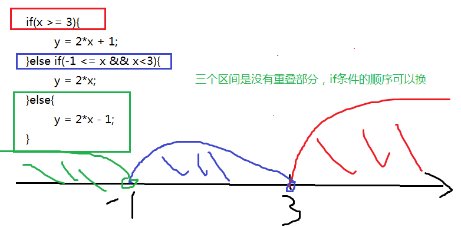

## day03_运算符和if流程控制语句

## 学习目标

- [ ] 逻辑运算符
- [ ] 三元运算符
- [ ] 位运算符
- [ ] 掌握键盘输入各种数据类型的值
- [ ] 理解if语句的格式和执行流程
- [ ] 理解if...else语句的格式和执行流程
- [ ] 理解if...else if语句的格式和执行流程
- [ ] 了解if语句和三元运算符互换
- [ ] 了解Math.random()和Math.sqrt(x)等的使用

## 3.1 逻辑运算符

```tex
逻辑运算符，是用来连接两个布尔类型结果的运算符（`!`除外），运算结果一定是boolean值true或者false
```

| 逻辑运算符 |   符号解释   |               符号特点               |
| :--------: | :----------: | :----------------------------------: |
|    `&`     |    与，且    |          有`false`则`false`          |
|    `|`     |      或      |           有`true`则`true`           |
|    `^`     |     异或     |     相同为`false`，不同为`true`      |
|    `!`     |      非      | 非`false`则`true`，非`true`则`false` |
|    `&&`    | 双与，短路与 |      左边为false，则右边不执行       |
|    `||`    | 双或，短路或 |       左边为true，则右边不执行       |

1. **课堂案例**

   ```java
   public class OperatorDemo06 {
   	public static void main(String[] args) {
   		int a = 3;
   		int b = 4;
   		int c = 5;
   
   		// & 与，且；有false则false
   		System.out.println((a > b) & (a > c)); 
   		System.out.println((a > b) & (a < c)); 
   		System.out.println((a < b) & (a > c)); 
   		System.out.println((a < b) & (a < c)); 
   		System.out.println("===============");
   		// | 或；有true则true
   		System.out.println((a > b) | (a > c)); 
   		System.out.println((a > b) | (a < c)); 
   		System.out.println((a < b) | (a > c));
   		System.out.println((a < b) | (a < c));
   		System.out.println("===============");
   		// ^ 异或；相同为false，不同为true
   		System.out.println((a > b) ^ (a > c));
   		System.out.println((a > b) ^ (a < c)); 
   		System.out.println((a < b) ^ (a > c)); 
   		System.out.println((a < b) ^ (a < c)); 
   		System.out.println("===============");
   		// ! 非；非false则true，非true则false
   		System.out.println(!false);
   		System.out.println(!true);
   	}
   }
   ```

2. **&&和&区别，||和|区别**

   短路与，短路或运算符左边表达式结果可以确定最终结果，则运算符右边表达式不再进行运算，**效率高**

   - **`&&`和`&`**区别：

     `&&`和`&`结果一样，`&&`有短路效果，左边为false，右边不执行；`&`左边无论是什么，右边都会执行。

   - **`||`和`|`**区别：

     `||`和`|`结果一样，`||`有短路效果，左边为true，右边不执行；`|`左边无论是什么，右边都会执行。

3. **面试题1**

   

   

   ```java
   public class LogicExer1{
   	public static void main(String[] args){
   		int x = 1;
   		int y = 1;
   
   		//x==2 ,x++  false  x = 2 左边为false
   		//右边继续
   		//++y  y==2  y=2  y==2成立  右边为true
   		//false & true 结果false
   		if(x++==2 & ++y==2){
   			x =7;
   		}
   		System.out.println("x="+x+",y="+y);//x=2,y=2
   	}
   }
   ```

   ```java
   public class LogicExer2{
   	public static void main(String[] args){
   		int x = 1,y = 1;
   
   		//x==2,x++  左边条件为false，x=2
   		//因为短路与，右边不执行
   		//false && ? 结果是false
   		if(x++==2 && ++y==2){
   			x =7;
   		}
   		System.out.println("x="+x+",y="+y);//x=2,y=1
   	}
   }
   ```

   ```java
   public class LogicExer3{
   	public static void main(String[] args){
   		int x = 1,y = 1;
   
   		//x==1,x++  左边为true，x=2
   		//因为是逻辑与,右边继续  
   		//++y, y==1  y=2 右边为false
   		//条件true | false，最终为true
   		if(x++==1 | ++y==1){
   			x =7;
   		}
   		System.out.println("x="+x+",y="+y);//x=7,y=2
   	}
   }	
   ```

   ```java
   public class LogicExer4{
   	public static void main(String[] args){
   		int x = 1,y = 1;
   
   		//x==1,x++  左边为true，x=2
   		//因为是短路或，左边为true，右边就不执行
   		//整个条件为true
   		if(x++==1 || ++y==1){
   			x =7;
   		}
   		System.out.println("x="+x+",y="+y);//x=7,y=1
   
   	}
   }
   ```

   


4. **面试题2**

5. 

   ```java
   public class LogicExer5{
   	public static void main (String []  args)  {
   		boolean x = true;
   		boolean y = false;
   		short z = 42;
   		
   		//如果if((z++==42)&&(y==true))条件成立，执行z++，不成立，就不执行z++
   		//左边的条件：z==42,z++  z==42成立,z++变成43
   		//中间虽然是短路与，因为左边现在是true,右边还要看
   		//右边 y==true   不成立
   		//true && false 结果为false 对应语句不执行
   		if((z++==42)&&(y==true))	z++;
   	
   		//左边为x=false,赋值  结果就为false
   		//中间虽然为短路或，因为左边是false,右边继续看
   		//++z,z==45  ++z变成44，z==45是否成立，不成立
   		//false || false  结果为false  对应语句不执行
   		if((x=false) || (++z==45))  z++;
   
   		System. out.println("z="+z);//44
   	}
   }
   ```

   ```java
   class  Test4_2  {
   	public static void main (String []  args)  {
   		boolean x = true;
   		boolean y = false;
   		short z = 42;
   		
   		//如果if(y=true)条件成立，接着判断if((z++==42)&&(y==true))	z++;	
   		//如果不成立，if((z++==42)&&(y==true))	z++;	不看的
   		/*
   		if(y = true)
   				
   		if((z++==42)&&(y==true))	z++;	
   		
   		if((x=false) || (++z==45))  z++;
   		*/
   		
   		//标准
   		//y=true赋值，y就被修改为true,if(true)成立
   		if(y=true){
   			//左边：z==42,z++  成立,z变成43
   			//&&短路与，不满足短路的情况，右边继续
   			//y==true 成立
   			//true && true，结果为true
   			if((z++==42)&&(y==true)){
   				//z++变成44
   				z++;
   			}
   		}
   		//左边：x=false不成立
   		//中间虽然是短路或，但是没满足短路的情况，右边继续
   		//++z,z==45  ++z变成45，z==45成立
   		if((x=false) || (++z==45)){
   			//z++，变成46
   			z++;
   		}
   		System. out.println("z="+z);//46
   	}
   }
   ```

   

## 3.2 条件运算符(三元运算符)

- 条件运算符格式：

```java
数据类型 变量名 = (条件表达式)？值1：值2;
```

- 条件运算符计算方式：
  - 条件判断的结果是true，条件运算符整体结果为值1，赋值给变量。
  - 判断条件的结果是false，条件运算符整体结果为值2，赋值给变量。

```java
public static void main(String[] args) {
    int i = (1==2) ? 100 : 200;
    System.out.println(i);//200
    int j = (3<=4) ? 500 : 600;
    System.out.println(j);//500
}
```

#### 练习

- **示例代码**

  - **获取两个数中的最大值**

    ```java
    class Demo1_Operator {
    	public static void main(String[] args) {
    
    		//(关系表达式) ? 表达式1 : 表达式2;
    		int x = 10;
    		int y = 5;
    		int z;
    		z = (x > y) ? x : y;
    		System.out.println("z = " + z);
    	}
    }
    ```

  - ##### 比较两个整数是否相同

    ```java
    class Test1_Operator {
    	public static void main(String[] args) {
    
    		//比较两个整数是否相同
    		int x = 10;
    		int y = 10;
    		//boolean b = (x == y) ? true : false;
    		boolean b = (x == y);
    		System.out.println("b = " +  b);
    	
    	}
    }
    ```

  - **获取三个整数中的最大值**

    ```java
    class Test1_Operator {
    	public static void main(String[] args) {
    
    		//获取三个整数中的最大值
    		int a = 10;
    		int b = 20;
    		int c = 30;
    		//先比较任意两个数的值,找出这两个数中的最大值
    		int temp = (a > b) ? a : b;
    		//用前两个数的最大值与第三个数比较,获取最大值
    		int max = (temp > c) ? temp : c;
    		System.out.println("max =" + max);
            
            // 只用三元运算符求三个值的最大值：
    		// int max = (((a > b) ? a : b) > c) ? ((a > b) ? a : b) : c;
    	}
    
    ```

## 3.3 位运算符（了解）

```tex
直接对**二进制数字**进行运算
```

| 位运算符 |                    符号解释                    |
| :------: | :--------------------------------------------: |
|   `&`    |        按位与，当两位相同时为1时才返回1        |
|   `|`    |         按位或，只要有一位为1即可返回1         |
|   `~`    | 按位非，将操作数的每个位（包括符号位）全部取反 |
|   `^`    |    按位异或。当两位相同时返回0，不同时返回1    |
|   `<<`   |                   左移运算符                   |
|   `>>`   |                   右移运算符                   |
|  `>>>`   |                无符号右移运算符                |

- 位运算符的运算过程都是基于补码运算，但是看结果，我们得换成原码，再换成十进制看结果
- 从二进制到十进制都是基于原码
- byte,short,char在计算时按照int类型处理
- 位运算直接对二进制进行位移操作实现数值运算，所以运算效率高

> 如何区分&,|,^是逻辑运算符还是位运算符？
>
> 如果操作数是boolean类型，就是逻辑运算符，如果操作数是整数，那么就位运算符。

1. #### 左移：<<


   运算规则：左移几位就相当于乘以2的几次方

   **注意：**当左移的位数n超过该数据类型的总位数时，相当于左移（n-总位数）位

   byte,short,char在计算时按照int类型处理

   ```java
   3<<4  类似于  3*2的4次= 3*16 = 48
   ```


   ```java
   -3<<4  类似于  -3*2的4次= -3*16 = -48
   ```

   

   

2. #### 右移：>>

   快速运算：类似于除以2的n次幂，如果不能整除，**向下取整**

   ```java
   69>>4  类似于  69/2的4次 = 69/16 =4
   ```

   

   ```
   -69>>4  类似于  -69/2的4次 = -69/16 = -5
   ```

   

   

3. #### 无符号右移：>>>


   运算规则：往右移动后，左边空出来的位直接补0，不看符号位

   正数：和右移一样

   负数：右边移出去几位，左边补几个0，结果变为正数

   ```
   69>>>4  类似于  69/2的4次 = 69/16 =4
   ```

   

   ```
   -69>>>4   结果：268435451
   ```

   

   

4. #### 按位与：&(遇0则0)


   运算规则：对应位都是1才为1

   1 & 1 结果为1

   1 & 0 结果为0

   0 & 1 结果为0

   0 & 0 结果为0

   ```
   9&7 = 1
   ```

   

   ```
   -9&7 = 7
   ```

   

   

5. #### 按位或：|(遇1则1)


   运算规则：对应位只要有1即为1

   1 | 1 结果为1

   1 | 0 结果为1

   0 | 1 结果为1

   0 & 0 结果为0

   ```
   9|7  结果： 15
   ```

   

   ```
   -9|7 结果： -9
   ```

   

   

6. #### 按位异或：^(相同0,不同1)


   运算规则：对应位一个为1一个为0，才为1

   1 ^ 1 结果为0

   0 ^ 1 结果为1

   0 ^ 0 结果为0

   ```
   9^7  结果为14
   ```

   

   ```
   -9^7 结果为-16
   ```

   

   

7. #### 按位取反

   运算规则：

   ​	~0就是1  

   ​	~1就是0

   ```java
   ~9  结果：-10
   ```

   

   ```java
   ~-9  结果：8
   ```

   

   

## 3.4 运算符优先级


提示说明：

（1）表达式不要太复杂

（2）先算的使用()

1. 大体的排序：算术 > 位  > 比较 > 逻辑 > 三元 > 赋值

不论哪一种编程语言，都会提供两种基本的流程控制结构：分支结构和循环结构。其中分支结构用于实现根据条件来选择性地执行某段代码，循环结构则用于实现根据循环条件重复执行某段代码。

**流程控制语句分类：**

1. 顺序结构：从上而下顺序执行每一行代码
2. 分支结构：或选择结构，根据条件选择执行不同的代码
3. 循环结构：重复执行某一些代码

## 3.5 顺序结构

任何编程语言中最常见的程序结构就是顺序结构。顺序结构就是程序从上到下逐行地执行，中间没有任何判断和跳转。如果main方法的多行代码之间没有任何流程控制，则程序总是从上向下依次执行，排在前面的代码先执行，排在后面的代码后执行。

**顺序结构代码执行流程图**：


**顺序结构代码示例：**

```java
public static void main(String[] args){
    //顺序执行，根据编写的顺序，从上到下运行
    	System.out.println("程序开始：");
		int a=10;
		int b=20;
		int sum=a+b;
		System.out.println("sum="+sum);//求两个数的和
		System.out.println("程序结束！");
}
```

###  键盘录入语句

以上程序是个求和的程序，我想在运行程序的时候，根据实际的输入的两个数，进行求和，就跟计算器一样，任意给两个数，计算得出结果，如何做？

1. **完成键盘输入的代码步骤：**

   ```tex
   - 导包
   	格式： import java.util.Scanner; //包  文件
   	位置：在class上面。
   - 创建键盘录入对象
   	格式：Scanner sc = new Scanner(System.in);//标准输入流
   	new 关键字 创建一个引用数据类型的对象
   - 通过对象获取数据
   	格式：int x = sc.nextInt();
   - 释放资源
   	格式:sc.close();
   ```

   示例代码：

   需求:

   ​	键盘录入一个数,并输出至控制台

   ```java
   import java.util.Scanner;
   class Demo1_Scanner {
   	public static void main(String[] args) {
           //1、准备Scanner类型的变量
      		//Scanner是一个引用数据类型，它的全名称是java.util.Scanner
      		//input就是一个引用数据类型的变量了，赋给它的值是一个对象
    		 Scanner sc = new Scanner(System.in);//System.in默认代表键盘输入
      
     		 //2、提示输入xx
     		 System.out.print("请输入一个整数：");
      
      		 //3、接收输入内容
      		 int num = input.nextInt();
           
            //4、释放资源
            sc.close();
      
     		 //列出各种数据类型的输入
      		int num = input.nextInt();
      		long bigNum = input.nextLong();
      		double d = input.nextDouble();
      		boolean b = input.nextBoolean();
      		String s = input.next();
      		char c = input.next().charAt(0);//先按照字符串接收，然后再取字符串的第一个字符（下标为0）
   ```

2. **案例一：求和案例**

   ```java
   import java.util.Scanner;
   class Demo1_Scanner {
       public static void main(String[] args){
           System.out.println("程序开始：");
           //创建一个扫描器
           Scanner sc=new Scanner(System.in);
   
           System.out.println("请输入第一个整数：");
           int a=sc.nextInt();//从键盘接收一个整数
   
           System.out.println("请输入第二个整数：");
           int b=sc.nextInt();//从键盘接收一个整数
   
           int sum=a+b;
           System.out.println("sum="+sum);
   
           System.out.println("程序结束");
       }
   }
   
   ```

   

3. **案例二：录入个人信息**

   ```java
   import java.util.Scanner;
   class Day03_Test02_Input{
   	public static void main(String[] args){
   		//这里变量取什么名，下面就用什么.
   		//例如：这里取名input，下面就用input.
   		Scanner input = Scanner(System.in);
   		
   		System.out.print("请输入姓名：");
   		String name = input.next();
   		
   		System.out.print("请输入年龄：");
   		int age = input.nextInt();
   		
   		System.out.print("请输入性别：");
   		//input.next()得到字符串，不管你输入几个字符，
   		//.charAt(0)：从字符串中取出一个字符，(0)表示取第一个字符，(1)表示取第二个字符
   		//charAt(index)：也是一个方法，从第二个单词开始首字母大写，所以A是大写
   		char gender = input.next().charAt(0);
   		
   		System.out.print("请输入体重：");
   		double weight = input.nextDouble();
   		
   		System.out.print("请输入是否已婚(true/false)：");
   		boolean isMarry = input.nextBoolean();
   		
   		System.out.println("姓名：" + name);
   		System.out.println("年龄：" + age);
   		System.out.println("性别：" + gender);
   		System.out.println("体重：" + weight);
   		System.out.println("婚否：" + (isMarry?"是":"否"));
   	}
   }
   ```


3. **案例三：**

   **next()与nextLine()接收字符数据的区别**

   ```java
   /*
   next()方法：
   	遇到空格等空白符，就认为输入结束
   nextLine()方法：
   	遇到回车换行，就认为输入结束
   	
   如果你在键盘输入过程中，遇到java.util.InputMismatchException，
   说明你输入的数据类型与接收数据的变量的类型不匹配
   */
   import java.util.Scanner;
   class Day03_Test04_Input2{
   	public static void main(String[] args){
   		Scanner input = new Scanner(System.in);
   		
   		System.out.print("请输入姓名：");
   		//String name = input.next();//张 三  只能接收张，后面的空格和三无法接收，被下面的输入接收
   		String name = input.nextLine();
   		System.out.println("name = " + name);
   		
   		System.out.print("请输入年龄：");
   		int age = input.nextInt();	//23回车换行  这里只接收23，回车换行被下面的输入接收	
   		input.nextLine();//读取23后面的回车换行，但是这个不需要接收，只有下面一个输入是nextLine()情况下才需要这样，如果下面的输入是next()或者是nextInt(),nextDouble()等就不需要这么干
   		System.out.println("age = " + age);
   		
   		System.out.print("请输入电话号码：");
   		String tel = input.nextLine();
   		System.out.println("tel = " + tel);
   	}
   }
   ```

   **练习：**

   键盘录入两个数据，获取这两个数据中的最大值（使用三元运算符）

   键盘录入三个数据，获取这三个数据中的最大值（使用三元运算符）

   键盘录入两个数据，比较这两个数据是否相等（使用三元运算符）

   

## 3.6 分支结构（选择结构）

### 3.6.1 分支结构：if语句第一种格式

1. **if语句第一种格式：** if

   ```java
   if(关系表达式)｛
     	语句体;
   ｝
   ```


2. **执行流程**

   ①首先判断条件表达式看其结果是true还是false

   ②如果是true就执行语句体

   ③如果是false就不执行语句体


3. **语法案例演示1：**


```java

  public static void main(String[] args){
      System.out.println("开始");
      // 定义两个变量
      int a = 10;
      int b = 20;
      //变量使用if判断
      if (a == b){
          System.out.println("a等于b");
      }
      int c = 10;
      if(a == c){
          System.out.println("a等于c");
      }
      System.out.println("结束");
  }
```

   


4. **语法案例演示2**

   案例：从键盘输入年份，请输出该年的2月份的总天数。闰年2月份29天，平年28天。

   闰年条件：（1）能被4整除，不能被100整除（2）能被400整除

   ```java
   import java.util.Scanner;
   public class Test {
   	public static void main(String[] args) {
   		Scanner input = new Scanner(System.in);
   		System.out.print("请输入年份：");
   		int year = input.nextInt();
   		int days = 28;
   		
   		if(year%4==0 && year%100!=0 || year%400==0){
   			days++;
   		}
   		System.out.println(year + "年的2月份共" + days + "天");
   		input.close();
   	}
   }
   ```

   ```java
   import java.util.Scanner;
   public class Test {
   	public static void main(String[] args) {
   		Scanner input = new Scanner(System.in);
   		System.out.print("请输入年份：");
   		int year = input.nextInt();
   		int days = 28;
   		
   		if(year%4==0 && year%100!=0 || year%400==0)
   			days++;//当语句块只有一句时，可以省略{}，但是建议还是保留比较靠谱
   		
   		System.out.println(year + "年的2月份共" + days + "天");
   		input.close();
   	}
   }
   ```


### 3.6.2 分支结构：if语句第二种格式

1. **if语句第二种格式：** if...else

   ```java
   if(关系表达式) { 
     	语句体1;
   }else {
     	语句体2;
   }
   ```


2. 执行流程

     ①首先判断关系表达式看其结果是true还是false

     ②如果是true就执行语句体1

     ③如果是false就执行语句体2

   


3. **语法案例演示1：**

   输入一个整数，判断是奇数还是偶数？

   ```java
      public static void main(String[] args){
          // 判断给定的数据是奇数还是偶数
          // 定义变量
          int a = 1;
          if(a % 2 == 0) {
              System.out.println("a是偶数");
          } else{
              System.out.println("a是奇数");
          }
          System.out.println("结束");
      }
   
   ```

4. **语法案例演示2：if语句和三元运算符的互换**

   在某些简单的应用中，if语句是可以和三元运算符互换使用的。

   求两个整数中大的一个

   ```java
   public static void main(String[] args) {
       int a = 10;
       int b = 20;
       //定义变量，保存a和b的较大值
       int max;
       if(a > b) {
         	max = a;
       } else {
         	max = b;
       }
       //可以上述功能改写为三元运算符形式
       max = a > b ? a : b;
   }
   ```

   ```java
   public static void main(String[] args) {
       int a = 10;
       int b = 20;
       //定义变量，保存a和b的较大值
       int max;
       if(a > b) 
         	max = a;//当语句块只有一个语句时，可以省略{}，但是不建议省略{}
        else 
         	max = b;
       //输出大的值
       System.out.println(max);
   }
   ```


- **练习：求出最大值**

  从键盘输入三个数，求出最大值，用单分支if和双分支if..else来计算

  ```java
  import java.util.Scanner;
  class Day03_Test08_MaxValueExer{
  	public static void main(String[] args){
  		Scanner input = new Scanner(System.in);
  		
  		System.out.print("请输入第1个整数：");
  		int a = input.nextInt();
  		
  		System.out.print("请输入第2个整数：");
  		int b = input.nextInt();
  		
  		System.out.print("请输入第3个整数：");
  		int c = input.nextInt();
  		
  		/*
  		int max;//存储三个数中的最大值
  		if(a > b){
  			max = a;
  		}else{
  			max = b;
  		}
  		if(c > max){
  			max = c;
  		}
  		*/
  		int max = a>b ? a : b;
  		max = max>c ? max : c;
  		System.out.println(a+","+b+","+c+"中最大的是："+ max);
  	}
  }
  ```


### 3.6.3 分支结构：if语句第三种格式

1. **if语句第三种格式：**

    if...else if ...else

   ```java
   if (判断条件1) {
     	执行语句1;
   } else if (判断条件2) {
     	执行语句2;
   }
   ...
   }else if (判断条件n) {
    	执行语句n;
   } else {
     	执行语句n+1;
   }
   ```


2. **执行流程**

     ①首先判断关系表达式1看其结果是true还是false

     ②如果是true就执行语句体1，然后结束当前多分支

     ③如果是false就继续判断关系表达式2看其结果是true还是false

     ④如果是true就执行语句体2，然后结束当前多分支

     ⑤如果是false就继续判断关系表达式…看其结果是true还是false

     ⑥…

     ⑦如果没有任何关系表达式为true，就执行语句体n+1，然后结束当前多分支。

  

3. **语法案例演示1：**

   计算如下函数：x和y的关系满足如下：
   （1）x>=3；         y = 2x + 1;
   （2）-1<=x<3；   y = 2x;
   （3）x<-1；          y = 2x – 1;
   从键盘输入x的值，计算出y的值并输出。

   ```java
   import java.util.Scanner;
   public static void main(String[] args) {
       Scanner input = new Scanner(System.in);
       System.out.print("请输入x的值：");
       int x = input.nextInt();
       int y;
       if (x>= 3) {
         	y = 2 * x + 1;
       } else if (x >= -1 && x < 3) {
         	y = 2 * x;
       } else  {
         	y = 2 * x - 1;
       }
       System.out.println("y的值是："+y);
   }
   ```

   改造：

   ```java
   import java.util.Scanner;
   public static void main(String[] args) {
       Scanner input = new Scanner(System.in);
       System.out.print("请输入x的值：");
       int x = input.nextInt();
       int y;
       if (x>= 3) {
         	y = 2 * x + 1;
       } else if (x >= -1) {//优化条件
         	y = 2 * x;
       } else  {
         	y = 2 * x - 1;
       }
       System.out.println("y的值是："+y);
   }
   ```

   

   


4. **案例演示2：**

   通过指定考试成绩，判断学生等级

   90-100      优秀

   80-89        好

   70-79        良

   60-69        及格

   60以下    不及格

   ```java
   public static void main(String[] args) {	
       int score = 89；
       if(score<0 || score>100){
         	System.out.println("你的成绩是错误的");
       }else if(score>=90 && score<=100){
         	System.out.println("你的成绩属于优秀");
       }else if(score>=80 && score<90){
         	System.out.println("你的成绩属于好");
       }else if(score>=70 && score<80){
         	System.out.println("你的成绩属于良");
       }else if(score>=60 && score<70){
         	System.out.println("你的成绩属于及格");
       }else {
         	System.out.println("你的成绩属于不及格");
       }	
   }
   ```

   

   ```java
   	public static void main(String[] args) {	
   	    int score = 89;
   	    if(score<0 || score>100){
   	      	System.out.println("你的成绩是错误的");
   	    }else if(score>=90){
   	      	System.out.println("你的成绩属于优秀");
   	    }else if(score>=80){
   	      	System.out.println("你的成绩属于好");
   	    }else if(score>=70){
   	      	System.out.println("你的成绩属于良");
   	    }else if(score>=60){
   	      	System.out.println("你的成绩属于及格");
   	    }else {
   	      	System.out.println("你的成绩属于不及格");
   	    }	
   	}
   ```

   


### 3.6.4 分支结构：if..else嵌套

在if的语句块中，或者是在else语句块中，
又包含了另外一个条件判断（可以是单分支、双分支、多分支）

执行的特点：
（1）如果是嵌套在if语句块中的
只有当外部的if条件满足，才会去判断内部的条件
（2）如果是嵌套在else语句块中的
只有当外部的if条件不满足，进入else后，才会去判断内部的条件

1. **语法案例演示1:**

   ```java
   	public static void main(String[] args) {	
   	    int score = 89;
   	    if(score<0 || score>100){
   	      	System.out.println("你的成绩是错误的");
   	    }else{
   	    	if(score>=90){
   		      	System.out.println("你的成绩属于优秀");
   		    }else if(score>=80){
   		      	System.out.println("你的成绩属于好");
   		    }else if(score>=70){
   		      	System.out.println("你的成绩属于良");
   		    }else if(score>=60){
   		      	System.out.println("你的成绩属于及格");
   		    }else {
   		      	System.out.println("你的成绩属于不及格");
   		    }	
   	    }
   	}
   ```

   ```java
   	//省略{}的情况，else中嵌套了一个完整的多分支结构，也算是一个语句，称为复合语句，所以也可以省略{}
   	public static void main(String[] args) {	
   	    int score = 89;
   	    if(score<0 || score>100)
   	      	System.out.println("你的成绩是错误的");
   	    else
   	    	if(score>=90){
   		      	System.out.println("你的成绩属于优秀");
   		    }else if(score>=80){
   		      	System.out.println("你的成绩属于好");
   		    }else if(score>=70){
   		      	System.out.println("你的成绩属于良");
   		    }else if(score>=60){
   		      	System.out.println("你的成绩属于及格");
   		    }else {
   		      	System.out.println("你的成绩属于不及格");
   		    }
   	}
   ```


2. **案例演示2：**

   从键盘输入一个年份，和月份，输出该年份该月的总天数

   要求：年份为正数，月份1-12

   ```java
   import java.util.Scanner;
   public class Test{
       public static void main(String[] args){
   		//从键盘输入一个年份，和月份
   		java.util.Scanner input = new java.util.Scanner(System.in);
   		
   		System.out.print("年份：");
   		int year = input.nextInt();
   		
   		System.out.print("月份：");
   		int month = input.nextInt();
   		
   		if(year>0){
   			if(month>=1 && month<=12){
   				//合法的情况
   				int days;
   				if(month==2){
   					if(year%4==0 && year%100!=0 || year%400==0){
   						days = 29;
   					}else{
   						days = 28;
   					}
   				}else if(month==4 || month==6  || month==9 || month==11){
   					days = 30;
   				}else{
   					days = 31;
   				}
   				System.out.println(year+"年" + month + "月有" + days +"天");
   			}else{
   				System.out.println("月份输入不合法");
   			}
   		}else{
   			System.out.println("年份输入不合法");
   		}
   	}
   }
   
   
   ```

## 3.7 IDEA的安装和调试程序

```text
详见文档
```

